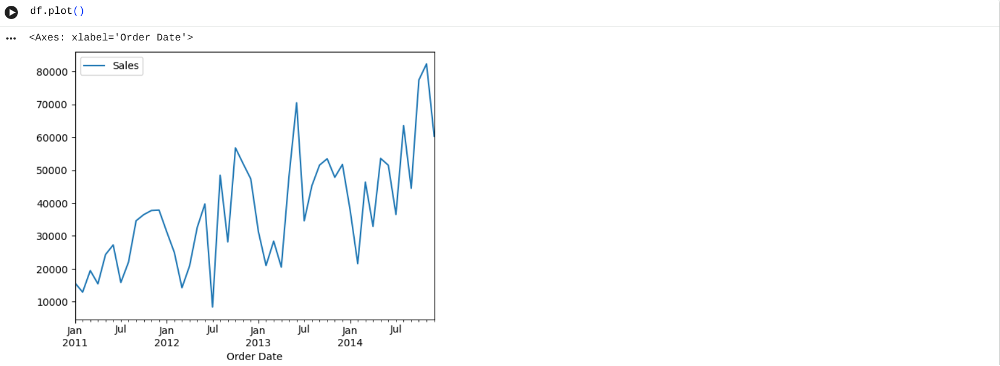
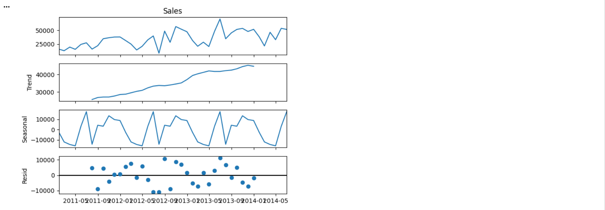
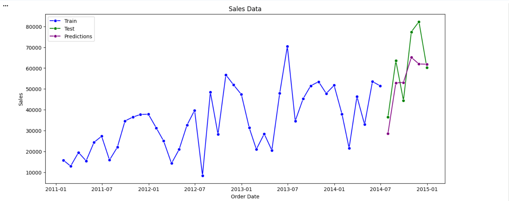

# Time Series Sales Forecasting Using **AR, ARIMA & SARIMA**

  A Python-based time series forecasting project to predict monthly sales using historical data.
  The project compares AR, ARIMA, and SARIMA models and selects the best-performing model based on RMSE and MAPE.
   
----
## Project Overview

This project demonstrates an end-to-end **time series forecasting workflow**, including:

- Data preprocessing and aggregation

- Train–test split for time series

- Trend and seasonality analysis

- Building AR, ARIMA, and SARIMA models

- Model evaluation using RMSE & MAPE

- Visualization of actual vs predicted sales

----------
## Problem Statement

Accurate sales forecasting is critical for business planning and inventory management.
Poor forecasts may lead to overstocking or stock shortages.
This project aims to forecast future sales using statistical time series models.

-----------

## Objectives
- Forecast future sales using historical data

- Compare AR, ARIMA, and SARIMA models

- Identify the best model using error metrics

- Visualize and interpret forecasting results

---------

## Technologies Used
- Python

- Pandas, NumPy

- Matplotlib, Seaborn

- Statsmodels

- Scikit-learn

-----------
## Project Workflow

1.Load and preprocess sales data

2.Convert data into time series format

3.Split data into training and testing sets

4.Analyze trend and seasonality

5.Build AR, ARIMA, and SARIMA models

6.Evaluate models using RMSE and MAPE

7.Plot actual vs predicted sales

----------
## Visualizations

1.**Original Sales Time Series**

  

2.**Train–Test Split Visualization**

  

3.**Seasonal Decomposition**

  

4.**Final Sales Forecast (SARIMA vs Actual)**

  

## Model Performance Comparison

| Model  | RMSE      | MAPE (%) |
| ------ | --------- | -------- |
| AR     | 14,915.16 | 24.42    |
| ARIMA  | 29,842.05 | 36.74    |
| SARIMA | 11,661.76 | 16.82    |

-------

**Observation:** SARIMA is the most accurate model, suitable for monthly sales forecasting with seasonality.

------

## Conclusion

- SARIMA outperformed AR and ARIMA models

- It provided the lowest forecasting error

- Suitable for sales data with clear seasonality

- Useful for business forecasting and decision-making

---------------

## How to Run the Project 

1.(https://github.com/khushboo-datasci/Time_Series_Sales_Forecasting)

2.pip install pandas numpy matplotlib seaborn statsmodels scikit-learn

3.Time_Series_Project.ipynb

--------------
 
git clone [(https://github.com/khushboo-datasci/Time_Series_Sales_Forecasting/edit/main/README.md)]

-----------

## Repository Structure

TimeSeriesSalesForecasting/
│
├── images/

│   ├── original_timeseries.png

│   ├── train_test_split.png

│   ├── seasonal_decomposition.png

│   └── final_forecast.png
│
├── Time_Series_Project.ipynb

├── README.md

-----------
**Author**

**Khushboo Kumari**
GitHub: https://github.com/khushboo-datasci

GitHub Profile
